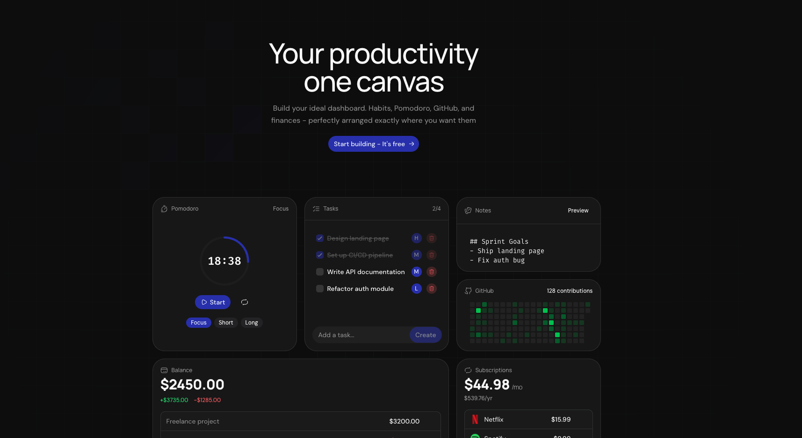

# Pennal

Open-source productivity dashboard on an infinite canvas. Drag, resize and arrange widgets however you think — tasks, notes, habits, timers, bookmarks and more, all in one place.

## Widgets

- **Notes** — markdown editor
- **Tasks** — to-do list with priorities
- **Pomodoro** — focus / break timer
- **Habits Tracker** — daily streaks
- **Routines** — morning & rest checklists with auto-reset
- **Bookmarks** — quick links
- **Money Balance** — income / expense tracker
- **Subscriptions** — monthly spend overview
- **Spotify** — embed player
- **GitHub** — contribution graph & notifications

## Tech Stack

- **Framework** — Next.js 16, React 19
- **State** — Jotai (atomWithStorage → localStorage)
- **UI** — shadcn/ui (luma preset), Tailwind CSS 4
- **Canvas** — custom CSS transforms + @dnd-kit
- **Auth** — better-auth (email + GitHub OAuth)
- **Database** — Neon Postgres + Drizzle ORM
- **Linting** — Biome

## Getting Started

```bash
bun install
bun dev
```

Open [http://localhost:3000](http://localhost:3000).

## Environment Variables

Copy `.env.example` to `.env` and fill in:

```
DATABASE_URL=           # Neon Postgres connection string
BETTER_AUTH_SECRET=     # Auth secret
GITHUB_CLIENT_ID=       # GitHub OAuth app
GITHUB_CLIENT_SECRET=
```

## License

MIT
